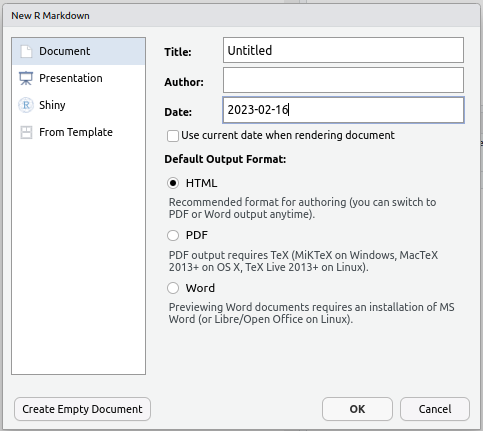

# R Markdown {background-color="#3c3c44" background-image=https://raw.githubusercontent.com/rstudio/rmarkdown/main/man/figures/logo.png background-size="35%" background-opacity="0.4" background-position="70% 50%"}

## Writing Reports Using `rmarkdown`

* `rmarkdown` is a cohesive way to
    + Load & wrangle data 
    + Analyse data, including figures & tables
    + Publish everything in a complete report/analysis
* The package `knitr` is the engine behind this
    + Replaced the `Sweave` package about 8-10 years ago
    
::: {.incremental}

* Extends the `markdown` language **to incorporate R code**
    + Newest incarnation is `quarto` $\implies$ better multi-language integration

:::

## Writing Reports Using `rmarkdown` {.slide-only .unlisted}

* Everything is one document
    + Our analysis code embedded alongside our explanatory text
* The entire analysis is performed in a fresh R Environment
    + Avoids issues with saving/re-saving Workspaces
* Effectively enforces code that runs sequentially

## A Brief Primer on Markdown

- Markdown is a very simple and elegant way to create formatted HTML
    + Text is entered as plain text
    + Formatting usually doesn't appear on screen ([but **can**]{.underline})
    + The parsing to HTML often occurs using `pandoc`
- Often used for Project README files etc.
- Not R-specific but is heavily-used across data-science

::: {.fragment}

1. Go to the File drop-down menu in RStudio
2. New File -> Markdown File
3. Save As `README.md`

:::

## Editing Markdown

- Section Headers are denoted by on or more `#` symbols
    + `#` is the highest level, `##` is next highest etc.

::: {.incremental}
- Italic text is set by enclosing text between a single asterisk (`*`) or underscore (`_`)
- Bold text is set by using *two asterisks* (`**`) or *two underscores* (`__`)
:::

::: {.fragment}
- Dot-point Lists are started by prefixing each line with `-`
    + Next level indents are formed by adding 2 or 4 spaces before the next `-`

:::
::: {.fragment}

- Numeric Lists are formed by starting a line with `1.`
    + Subsequent lines don't need to be numbered in order
    
:::
    
## Editing Markdown {.slide-only .unlisted}

Let's quickly edit our file so there's something informative

::: {.fragment}

Enter this on the top line

`# Introduction to R, Sept 2-3 2025`

:::
::: {.fragment}

Two lines down add this

`## Course Outline`

:::
::: {.fragment}

Leave another blank line then add

`1. Introduction to R and R Studio`  
`2. Importing Data`  
`3. Data Visualisation`  
`4. R Markdown`  

:::

## Editing Markdown {.slide-only .unlisted}

Underneath the list enter:

`**All material**` can be found at \[the course homepage\]\(http://blackochrelabs.au/20250902_ASI_R_Workshop/\)

::: {.fragment}
- Here we've set the first two words to appear in bold font
- The section in the square brackets will appear as text with a hyperlink to the site in the round brackets

:::
::: {.fragment}

- Click the `Preview Button` and an HTML document appears
- Note that README.html has also been produced 
    + Sites like github/gitlab render this automatically
    + Obsidian also renders interactively

:::

# R Markdown {background-color="#3c3c44" background-image=https://raw.githubusercontent.com/rstudio/rmarkdown/main/man/figures/logo.png background-size="35%" background-opacity="0.4" background-position="70% 50%"}

## Writing Reports Using `rmarkdown`

We can output our analysis directly as:

* HTML
* MS Word Documents
* PDF Documents (If you have $\LaTeX$ installed)
* HTML or PowerPoint presentations

We never need to use MS Word, Excel or PowerPoint again!

## Writing Reports Using `rmarkdown` {.slide-only .unlisted}

- The file suffix is `.Rmd`
- Include both markdown + *embedded `R` code.*
- Create all of our figures & tables directly from the data
- Data, experimental and analytic descriptions
- Mathematical/Statistical equations
- Nicely Formatted Results
- Any other information: citations, hyperlinks etc.

::: {.notes}
- This course was prepared using the next generation known as quarto
- Extends RMarkdown across multiple languages
:::

## Creating an *R* Markdown document

Let's create our first `rmarkdown` document

1. Go to the `File` drop-down menu in RStudio
2. New File -> R Markdown...

::: {.fragment}



:::


## Creating an *R* Markdown document {.slide-only .unlisted}

1. Change the Title to: My First Report
2. Change the Author to however you'd like to refer to yourself
3. Leave everything else as it is & hit OK
4. Save the file as `RMarkdownTutorial.Rmd`

## Looking At The File

A *header section* is enclosed between the `---` lines at the top

- __Nothing can be placed before this!__
- Uses YAML (**Y**AML **A**in't **M**arkup **L**anguage)
- Editing is beyond the scope of this course
- Can set custom `.css` files, load LaTeX packages, set parameters etc.

## Looking At The File {.slide-only .unlisted}

Lines 8 to 10 are a code `chunk`

- Chunks always begin with ```{r}
- Chunks always end with ```
- Executed `R` code goes between these two delineation marks

::: {.fragment}
- Chunk names are optional and directly follow the letter `r`
    + Chunks can also be other languages (`bash`, `python` etc.)
    + Here the `r` tells RMarkdown the chunk is an `R` chunk

:::
::: {.fragment}

- Other parameters are set in the chunk header
    + e.g. do we show/hide the code
    + The master reference is [here](https://yihui.org/knitr/options/#chunk-options)

:::

## Looking At The File {.slide-only .unlisted}

Line 12 is a Subsection Heading, starting with `##`

- Click the _Outline_ symbol in the top-right of the Script Window
- Chunk names are shown in _italics_ (if set to be shown)
    + `Tools` > `Global Options` > `R Markdown` 
    + Show in document outline: Sections and All Chunks
- Section Names in plain text
- Chunks are indented within Sections
- By default Sections start with `##`
    + Only the Document Title should be Level 1 `#`

## Getting Help

Check the help for a guide to the syntax.

`Help > Markdown Quick Reference`

- Increasing numbers of `#` gives Section `->` Subsection `->` Subsubsection etc.
- **Bold** is set by \*\*Knit\*\* (or \_\_Knit\_\_)
- *Italics* can be set using a single asterisk/underline: \*Italics\* or \_Italics\_
- `Typewriter font` is set using a single back-tick \`Typewriter\`


## Compiling The Report

The default format is an `html_document` & we can change this later.
Generate the default document by clicking `Knit`


## Compiling The Report {.slide-only .unlisted}

The Viewer Pane will appear with the compiled report (probably)

- Note the hyperlink to the RMarkdown website & the bold typeface for the word **Knit**
- The *R* code and the results are printed for `summary(cars)`
- The plot of `temperature` Vs. `pressure` has been embedded
- The code for the plot was hidden using `echo = FALSE`

## Compiling The Report {.slide-only .unlisted}
    
- We could also export this as an MS Word document by clicking the small 'down' arrow next to the word Knit.
- By default, this will be Read-Only, but can be helpful for sharing with collaborators.
- Saving as a `.PDF` requires $\LaTeX$
    + Beyond the scope of today

# Making Our Own Report {background-color="#3c3c44"}

## Making Our Own Report

Now we can modify the code to create our own analysis.

- Delete everything in your R Markdown file EXCEPT the header
- We'll analyse the `pigs` dataset
- Edit the title to be something suitable

## Making Our Own Reports {.slide-only .unlisted}

What do we need for our report?

- Load and describe the data using clear text explanations
    + Maybe include the questions being asked by the study
- Create figures which show any patterns, trends or issues
- Perform an analysis
- State conclusions
- Send to collaborators

## Making Our Own Reports {.slide-only .unlisted}

- First we'll need to load the data
    + Then we can describe the data
- RMarkdown *always* compiles from the directory it is in
    + File paths should be relative to this
    
::: {.fragment}

- My "first" real chunk always loads the packages we need

:::

## Creating a Code Chunk

```{r load-tidyverse, echo=FALSE}
library(tidyverse)
```


- `Alt+Ctrl+I` creates a new chunk on Windows/Linux
    + `Cmd+Option+I` on OSX

::: {.fragment}

- Type `load-packages` next to the  \`\`\`{r  
    + This is the chunk name
    + Really helpful habit to form
    
:::
::: {.fragment}

- Enter `library(tidyverse)` in the chunk body
    + We'll add other packages as we go

:::
::: {.fragment}

*Knit...*

:::

## Dealing With Messages

- The `tidyverse` is a little too helpful sometimes
    + These messages look horrible in a final report
    + Are telling us which packages/version `tidyverse` has loaded
    + Also informing us of conflicts (e.g. `dplyr::filter` Vs. `stats::filter`)
    + Can be helpful when running an interactive session
- We can hide these from our report

## Dealing With Messages {.slide-only .unlisted}

1. Go to the top of your file (below the YAML)
2. Create a new chunk
3. Name it `setup`
4. Place a comma after `setup` and add `include = FALSE`
    + This will hide the chunk from the report

::: {.fragment}
5. In the chunk body add `knitr::opts_chunk$set(message = FALSE)`
    + This sets a global parameter for all chunks
    + i.e. Don't print "helpful" messages

:::
::: {.fragment}

*Knit...*

:::

## Making Our Own Reports


- I like to load all data straight after loading packages
- Gets the entire workflow sorted at the beginning
- Alerts to any problems early

::: {.fragment}

Below the `load-packages` chunk:

- Create a new chunk
- Name it `load-data`
- In the chunk body load `pigs` using `read_csv()`

:::
::: {.fragment}

```{r load-data}
pigs <- read_csv("data/pigs.csv") |>
    mutate(
        dose = fct(dose, levels = c("Low", "Med", "High")),
        supp = fct(supp, levels = c("VC", "OJ"))
    )
```

:::

::: {.notes}
Chunks can be run interactively using `Ctrl+Alt+Shift+P`
:::

## Describing Data

Now let's add a section header for our analysis to start the report

1. Type `## Data Description` after the header and after leaving a blank line
2. Use your own words to describe the data
    + Consider things like how many participants, different methods, measures we have etc.

::: {.fragment}


> 60 guinea pigs were given vitamin C, either in their drinking water in via orange juice.
> 3 dose levels were given representing low, medium and high doses.
> Odontoblast length was measured in order to assess the impacts on tooth growth

:::

## Describing Data {.slide-only .unlisted}

- In my version, I mentioned the study size
- We can **take this directly** from the data
    + Very useful as participants change
- `nrow(pigs)` would give us the number of pigs

::: {.fragment}

Replace the number 60 in your description with  \``r` `nrow(pigs)`\`

*Knit...*

:::

## Visualising The Data

The next step might be to visualise the data using a boxplot

- Start a new chunk and name it `boxplot-data`

::: {.fragment}


```{r boxplot-data}
#| output-location: column-fragment
pigs |>
    ggplot(aes(dose, len, fill = supp)) +
    geom_boxplot() +
    labs(
        x = "Dose",
        y = "Odontoblast Length (pm)", 
        fill = "Method"
    ) +
    scale_fill_brewer(palette = "Set2") +
    theme_bw()
```

:::

## Visualising the Data {.slide-only .unlisted}

- We can control the figure size using `fig.height` or `fig.width`
- Type a description of the figure in the `fig.cap` section of the chunk header
    + This will need to be placed inside quotation marks
    
::: {.fragment}

My example text:

> Odontoblast length shown by supplement method and dose level

:::
    
## Summarising Data

- Next we might like to summarise the data as a table
    + Show group means & standard deviations
    
::: {.fragment}

- Add the following to a new chunk called `data-summary`
    + I've used the HTML code for $\pm$ (\&#177;)

    
```{r}
#| output-location: column
#| results: markup
pigs |>
    summarise(
        n = n(),
        mn_len = mean(len), 
        sd_len = sd(len),
        .by = c(supp, dose)
    ) |>
    mutate(
        mn_len = round(mn_len, 2),
        sd_len = round(sd_len, 2),
        len = paste0(mn_len, " &#177;", sd_len)
    ) |>
    dplyr::select(supp, dose, n, len)
```

*Knit...*

:::

## Summarising Data {.slide-only .unlisted}

- This has given a tibble output
- We can produce an HTML table using `pander`

::: {.fragment}

Add the following to your `load-packages` chunk


```{r}
library(pander)
```

:::

## Producing Tables

::: {style="font-size: 93%"}

```{r}
#| results: asis
#| output-location: slide
pigs |>
    summarise(
        n = n(), 
        mn_len = mean(len), 
        sd_len = sd(len),
        .by = c(supp, dose)
    ) |>
    mutate(
        mn_len = round(mn_len, 2),
        sd_len = round(sd_len, 2),
        len = paste0(mn_len, " &#177;", sd_len)
    ) |>
    dplyr::select(supp, dose, n, len) |>
    rename_with(str_to_title) |>
    pander(
        caption = "Odontoblast length for each group shown as mean&#177;SD"
    )
```

:::


## Analysing Data


::: {.incremental}

- Performing statistical analysis is beyond the scope of today BUT
    + The function `lm()` is used to perform linear regression
    + We'll perform an analysis remembering that `~` means 'depends on'
    
::: 

::: {style="font-size:88%"}

::: {.fragment}
    
```{r}
#| output-location: column
#| results: markup
lm(len ~ supp + dose + supp:dose, data = pigs) |>
    summary()
```

:::

:::

## Analysing Data {.slide-only .unlisted}

::: {style="font-size:90%"}

- `pander` can again be used to 'tidy up' the output from `lm`

```{r}
#| output-location: slide
#| results: asis
lm(len ~ supp + dose + supp:dose, data = pigs) |>
    summary() |>
    pander(add.significance.stars = TRUE)
```

:::

::: {.notes}
Interpretation:

- At Low Dose, OJ increases length by 5.25 above VC
- Both Med & High increase length for VC
- The difference in length for OJ is the same for Med as for Low
- The gains for length by OJ are completely lost at High Dose
:::


## Creating Summary Tables

- Multiple other packages exist for table creation
    + All do some things brilliantly, none does everything
- `pander` is a good all-rounder
    + Tables are very simplistic
    + Also enables easy in-line results
    
    
## Creating Summary Tables {.slide-only .unlisted}
    
- To use other packages, $\implies$ `broom::tidy()` 
    + Will convert `lm()` output to a `tibble`
    + This can be passed to other packages which make HTML / $\LaTeX$ tables

```{r}
#| results: markup
lm(len ~ supp + dose + supp:dose, data = pigs) |>
    broom::tidy()
```

```{r, echo=FALSE}
knitr::opts_chunk$set(eval = FALSE)
```

## Creating Summary Tables {.slide-only .unlisted}

- `reactable` creates amazing looking tables
    + A bit difficult to download the table data
- `DT` also creates fantastic tables
    + Less flexible with formatting
    + Allows simple downloading to `csv`, `xls` etc.
- `gt` is popular with some
- `xtable` is excellent for $\LaTeX$ output

    
## Other Chunk Options

- Here's my `setup` chunk for this presentation

```r
knitr::opts_chunk$set(
  echo = TRUE, include = TRUE, warning = FALSE, message = FALSE, 
  fig.align = "center", results = 'hide', fig.show = "asis",
  fig.width = 6
)
```

::: {.fragment}

- When you've seen my results, I've set `results = 'asis'` in that chunk header

:::

## Complete the Analysis

After you're happy with the way your analysis looks

- A good habit is to finish with a section called `Session Info`
- Add a code chunk which calls the *R* command `sessionInfo()`

So far we've been compiling everything as HTML, but let's switch to an MS Word document.
We could email this to our collaborators, or upload to Google docs


## Summary

This basic process is incredibly useful

- We never need to cut & paste anything between R and other documents
- Every piece of information comes directly from our *R* analysis
- We can very easily incorporate new data as it arrives
- Source data is **never modified**
- Creates *reproducible research*
- Highly compatible with collaborative analysis & version control (Git)

::: {.notes}
I learned using R scripts but now I only use these in formal packages, or if defining functions to use across multiple analyses
:::

## Advanced Options

- The `R` package `workflowr` is very helpful for larger workflows
    + Can include multiple HTML pages
    + Strong integration with `git`
- Highly customisable output
    + Code folding
    + Bootstrap themes etc.
    + Can use custom `css` files 
    + Interactive plots using `plotly`

    
## Challenge

- Load `my_penguins`
- Describe the data
- Visualise the data
- (If you're keen) fit a linear model for one of the measurements & the predictor(s) of your choice
